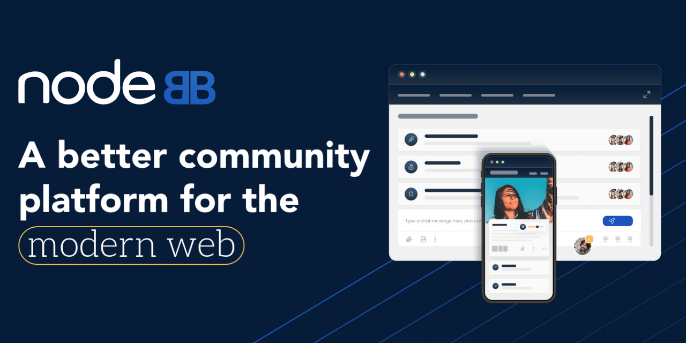

# 

[](https://www.gnu.org/licenses/gpl-3.0)

[**NodeBB Forum Software**](https://nodebb.org) is powered by Node.js and supports either Redis, MongoDB, or a PostgreSQL database. It utilizes web sockets for instant interactions and real-time notifications. NodeBB takes the best of the modern web: real-time streaming discussions, mobile responsiveness, and rich RESTful read/write APIs, while staying true to the original bulletin board/forum format &rarr; categorical hierarchies, local user accounts, and asynchronous messaging.

NodeBB by itself contains a "common core" of basic functionality, while additional functionality and integrations are enabled through the use of third-party plugins.

This repository is a forked version of the base [NodeBB repository](https://github.com/NodeBB/NodeBB) with various modifications to support curriculum use.

### [Demo](https://try.nodebb.org) | [Documentation](https://docs.nodebb.org)

## Theming

NodeBB's theming engine is highly flexible and does not restrict your design choices. This version of the repository has our minimalist "Persona" theme installed to get you started.

NodeBB's base theme utilizes [Bootstrap 3](http://getbootstrap.com/) but themes can choose to use a different framework altogether.

[](http://i.imgur.com/HwNEXGu.png)
[](http://i.imgur.com/II1byYs.png)

## Installation

Follow the installation instructions in the [Project 1 Writeup](https://cmu-313.github.io/projects/P1/) on the course website.

For feature development, we highly recommend you install and use the suggested [grunt-cli](https://docs.nodebb.org/configuring/running/#grunt-development) to enable file-watching and live refresh. We also highly recommend you use [VSCode](https://code.visualstudio.com/download) or similar for the development of this project.

When running in a development environment, you can find the API specs for NodeBB at [http://localhost:4567/debug/spec/read](http://localhost:4567/debug/spec/read) and [http://localhost:4567/debug/spec/write](http://localhost:4567/debug/spec/write).

## TypeScript

This codebase is in the process of being translated to [TypeScript](https://www.typescriptlang.org/)! During this intermediate stage, translated files will contain both a `.ts` and `.js` file in the repository. Translated files should be edited **only in the `.ts` file**; corresponding `.js` files will be automatically compiled and generated by the `% npx tsc` command.

If using VSCode, you can remove duplicate files from your Explorer view by adding the following to your `.vscode/settings.json` file:

```
{
    "files.exclude": {
        "**/*.js": { "when": "$(basename).ts" },
        "**/**.js": { "when": "$(basename).tsx" }
    }
}
```

VSCode can provide a lot of other assistance too, such as recommending package installs and providing typing information on hover.

## Development Tools

This repository comes with tools for linting (ESLint), testing (Mocha), and coverage reporting (nyc). All of these tools can be run locally:

```
% npm run lint      // Runs the linter
% npm run test      // Runs test suite + generates coverage report
```

The first time you run the test command, it may fail and ask you to provide a configuration for a test database. Scroll up past the errors and, depending on your local database setup, follow the provided instructions to add a test database configuration to `config.json` and re-run the testing command.

After running the test suite, you can find the coverage report generated in the `coverage` directory. This can be viewed in the browser by opening the `index.html` file in this directory.

If you want to directly run the linting and testing commands with specific configurations (i.e. only running the test suite on specific files, using `--fix` with ESLint), you can find the underlying commands are in the `package.json` file.

## Database (Redis)

### Schema and Data

Schema files located at `public/openapi/components/schemas` as `.yaml` files. These are called during the build/init of the database. To see how these correspond to existing entries, download `RedisInsight-v2` application from the internet. The Hash Keys in the database reflect what is shown in the schema files.

There are also files under `public/openapi/read` that detail the data that is pulled for any GET request performed by the application. `public/openapi/read.yaml` species the route to the API and the corresponding `.yaml` file that contains the structure for the retrieved data.

Presumedly, adding a new datase table will require creating a schema file. Then, to access the data in the database, a new API/route needs to be created and the format added as a `openapi/read/*.yaml` file that is linked to in the `openapi/read.yaml`file.

### Files

- `src/database/redis.js`: Methods for initializing the redis host, port, etc. Contains init, close, and info functions
- `src/database/index.js`: Connects to a DB via the session store object
- `src/database/redis/hash.js`: Increment PK ids, get/edit/delete objects and their fields
- `src/database/redis/main.js`: Flush, empty, check if DB exists. Basic getts and setters for keys
- `src/topics/create.js`: Example of CRUD operations for topics as a reference for our bug reports
- `src/bugs`: New directory for creating bug reports

## License

NodeBB is licensed under the **GNU General Public License v3 (GPL-3)** (http://www.gnu.org/copyleft/gpl.html).

## Helpful Links

- [NodeBB Demo](https://try.nodebb.org)
- [NodeBB Documentation](http://docs.nodebb.org)
- **Git & Github:**
  - [Git Documentation](https://git-scm.com/docs/gittutorial)
  - [Git Flow](https://datasift.github.io/gitflow/IntroducingGitFlow.html)
  - [GitHub Basics](https://guides.github.com/activities/hello-world/)
  - [GitHub's Flow](https://guides.github.com/introduction/flow/)
  - [GitHub Cross-Referencing](https://docs.github.com/en/github/writing-on-github/working-with-advanced-formatting/autolinked-references-and-urls#issues-and-pull-requests)
- **Frontend Development:**
  - [Benchpress Documentation](https://github.com/benchpressjs/benchpressjs)
  - [Bootstrap 3 Documentation ](http://getbootstrap.com/)
- **Server Development:**
  - [Node.js Documentation](https://nodejs.org/en/docs/)
- **Database/Backend:**
  - [Redis Documentation](https://redis.io/docs/)
  - [Redis CLI](https://redis.io/docs/manual/cli/)
- **Linting & Testing:**
  - [Mocha Documentation](https://mochajs.org/)
  - [ESLint Documentation](https://eslint.org/docs/latest/)
  - [nyc Test Coverage Documentation](https://www.npmjs.com/package/nyc)
- **TypeScript:**
  - [TypeScript for New Programmers](https://www.typescriptlang.org/docs/handbook/typescript-from-scratch.html)
  - [TypeScript for JavaScript Programmers](https://www.typescriptlang.org/docs/handbook/typescript-in-5-minutes.html)
  - [JavaScript to TypeScript Translation](https://www.typescriptlang.org/docs/handbook/migrating-from-javascript.html#moving-to-typescript-files)
